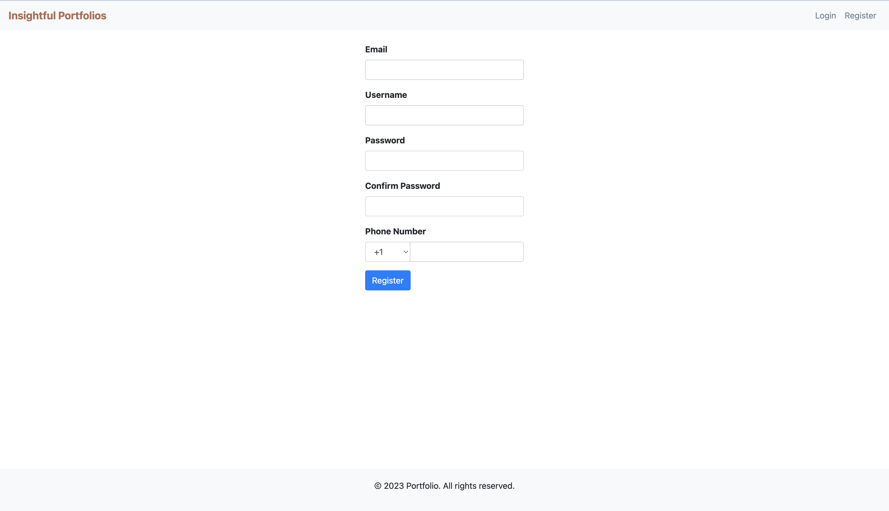
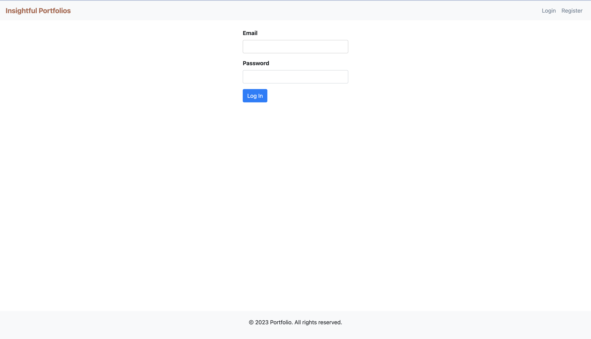
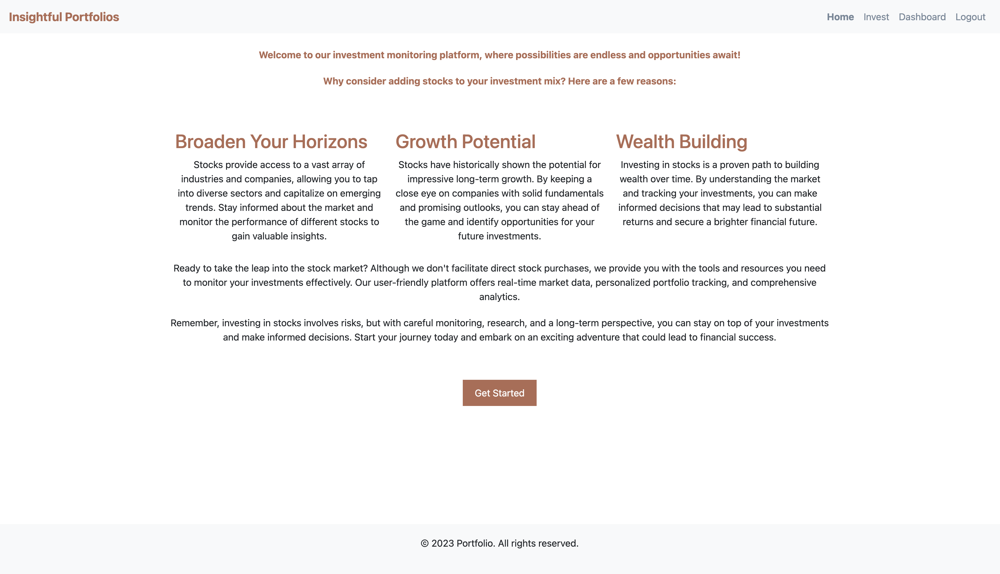
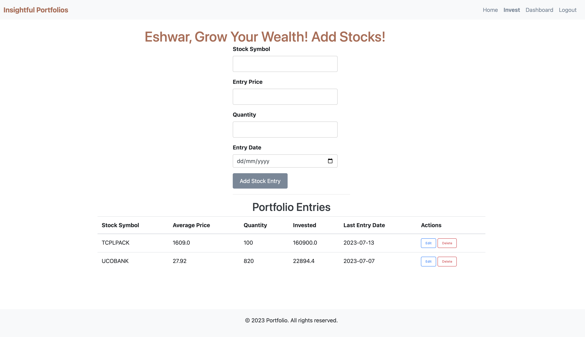
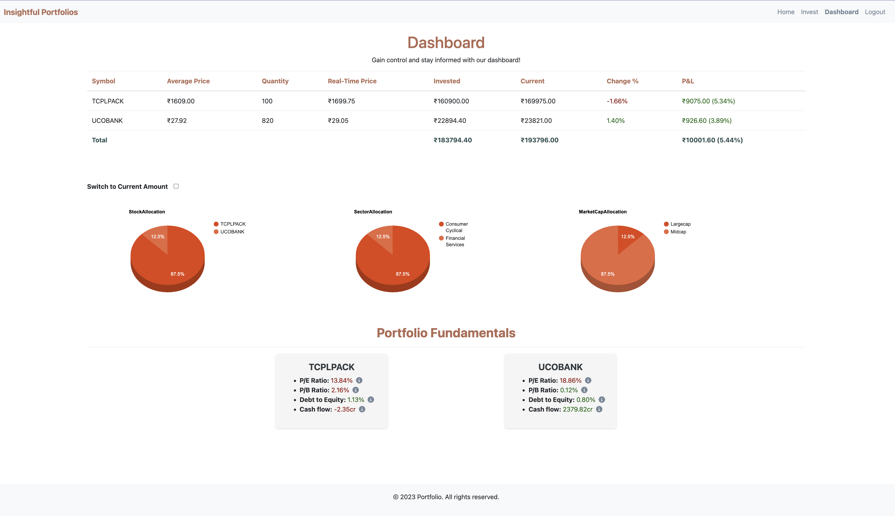

# Portfolio Analysis Web Application

This is a simple web application for portfolio analysis. Users can register, log in, and analyze their investment portfolios.

## Features

- User registration: Users can create an account by providing their email, username, and password.
- User login: Registered users can log in with their email and password.
- Home page: After logging in, users are redirected to the home page where they can view their portfolio analysis.
- Portfolio analysis: Users can analyze their investment portfolios to gain insights into their performance.
- Logout: Users can log out of their accounts.

## Technologies Used

- Python
- Flask
- Flask-WTF
- WTForms
- Flask-Bcrypt
- SQLAlchemy
- SQLite

## Setup Instructions

1. Clone the repository:

    git clone https://github.com/your-username/portfolio-analysis-web-app.git

2. Navigate to the project directory:

    cd portfolio-analysis-web-app

3. Install the dependencies:

    pip install -r requirements.txt

4. Run the application:

    flask run

5. Run the application:

    flask run

6. Open your web browser and visit http://localhost:5000 to access the application.

7. Usage:

    - Register: Click on the "Register" link on the navigation bar and fill out the registration form with your details.
    - Log in: After registration, you will be redirected to the login page. Enter your email and password to log in.
    - Home page: Upon successful login, you will be redirected to the home page where you can view your portfolio analysis.
    - Logout: To log out of your account, click on the "Logout" link on the navigation bar.

## License
This project is licensed under the MIT License.
